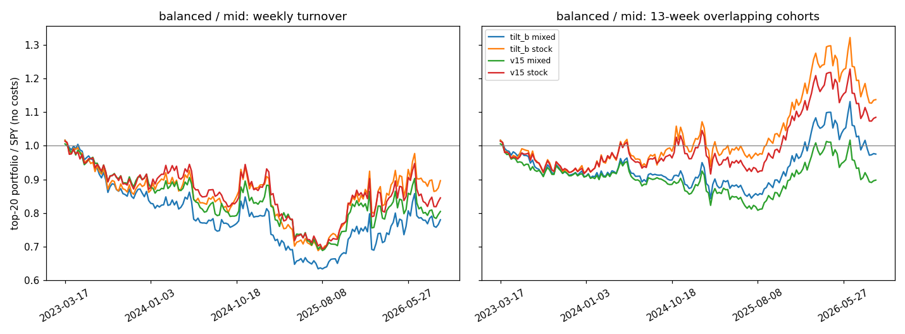
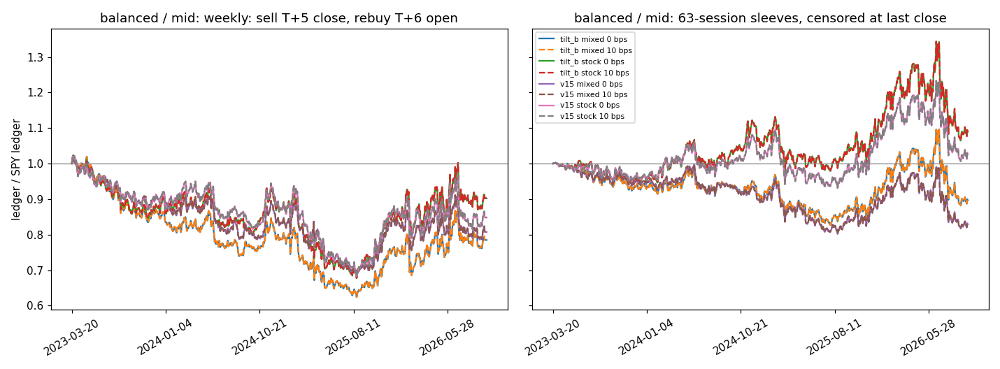

# 全市场选股 v1.6：生产口径的历史回放

v1.5 的离线评估用的是按公式简化复刻的因子（`full_market_v1_5/`）。这一轮改为直接调用生产代码回放历史：每个回放日都走生产任务的完整流程，得到的就是那一天线上会发布的九组名单，再计算这些名单之后的实际收益。候选、指标和取舍规则在跑之前写进了 [PREREGISTRATION.md](PREREGISTRATION.md)。

## 数据

- **行情**：Massive 全市场日汇总原始价，`adjusted=false`、`include_otc=false`，与生产相同。区间是 Massive 当前套餐能取到的滚动 5 年，即 2021-09-28 到 2026-09-25，2026-09-27 冻结。另外冻结了同期的拆股。原始响应逐日存放在用户的 Google Drive（`option-pro-data/massive_frozen_2026-09-27/`），用 `SHA256SUMS` 校验。
- **证券目录**：每个 ISO 周最后一个工作日取一份点时目录（`/v3/reference/tickers?date=`），共 261 份。回放日用当周或之前最近的一份，因此退市股票、后来改名或代码被复用的股票都按当时的状态进入股票池，不存在幸存者偏差。
- **缓存库**：`scripts/build_replay_db.py` 按生产缓存的表结构重建，每一行都经过生产的 `_raw_bar` 和 `_split_row` 校验。结果为 1,254 个交易日、1,391 万行，被拒 0 行，拆股 6,441 条。

原始行情受 Massive 的使用许可约束，不放进仓库；仓库里只有脚本和汇总结果。

## 回放方法

`scripts/replay.py` 对每个回放日 T 依次执行生产代码：

1. 在当周的点时目录上调用 `select_all_market_universe`。
2. 用 `_required_sessions` 取以 T 结尾的 370 个交易日，调用 `_session_manifest`，再用 `_load_panel` 建面板。拆股只用执行日落在这个窗口内的记录。
3. 依次调用 `prepare_limited_panel`、`precompute_all_horizon_inputs` 和 `score_eod_session`，含 v1.5 调参挂钩。
4. 用 `_compact_variant` 和 `project_strength_payload` 投影出名单，再按 `/api/strength/scan` 的口径过滤和排序：价格不低于 5 美元，按 `sort_score` 降序、代码升序。

完整日线少于合资格数 90% 的日子，生产不会发布，回放记录下来但不参与评估。各方案共用同一天的预计算结果，因为预计算不读取偏好倾斜；每个方案各用一份快照缓存。

**还原度校验**：对 2026-09-25，用当前在市目录回放 v1.5，和线上当天发布的九组名单逐一比对（`scripts/compare_live.py`，通过标准在比对前写定）。九组全部通过：
- 名单长度完全一致（9、11、16、31、39、52、112、103、108）；
- 前 20 名全部重合；
- 保存下来的每一行，分数差都小于 0.5 分。

## 收益口径

`scripts/evaluate.py` 按以下口径计算：
- **进出场**：T 日收盘后出名单，T+1 开盘买入，T+h 收盘卖出，h 取 5、20、63 个交易日。价格用冻结的原始价，拆股用同一张拆股表复权。
- **缺行情**：卖出前遇到缺行情（退市、停牌、代码被复用），就按缺口前最后一个收盘价卖出，不跨缺口接续。
- **超额收益**：相对 SPY 同一窗口计算。
- **主指标**：前 20 名的补位超额。名单不足 20 只时，空位按 SPY 计，即超额为 0。
- **t 值**：用 Newey-West 调整，滞后阶数取 h/5 − 1。

## 结果

回放了 176 个信号日（2023-03-17 到 2026-09-14），九组名单全部打分，覆盖闸门都通过。63 日标签完整的有 165 个信号日。完整表格在 `results/stage1/`：
- `metrics.csv`：每组视图、每种名单、前 10 和前 20 名、每个持有期、每个分段的指标。
- `primary.csv`：主指标汇总。
- `decision.json`：取舍规则的逐条核对。
- `paired.csv`：同一天配对的差值及 t 值。

### 主指标

前 20 名 63 日补位超额，单位是每个信号的百分点，取三个周期视图的平均：

| 名单 | 档位 | v1.5 基线 | tilt_a | tilt_b | r0 | tilt_a_r0 |
|---|---|---|---|---|---|---|
| 股票基金混排 | 保守（v1.4 对照） | −3.23 | | | | |
| 股票基金混排 | 均衡 | −1.10 | −0.98 | −0.57 | −0.43 | −0.30 |
| 股票基金混排 | 进取 | −1.54 | −1.02 | −0.76 | −0.54 | −0.23 |
| 只看股票 | 保守（v1.4 对照） | −2.90 | | | | |
| 只看股票 | 均衡 | +0.43 | +0.67 | +0.84 | +0.19 | +0.44 |
| 只看股票 | 进取 | +0.08 | +0.52 | +0.81 | +0.33 | +0.87 |

### 同一天配对的差值

63 日期限，165 个信号日，t 值做了 Newey-West 调整，滞后 11 阶：

| 比较 | 保守 | 均衡 | 进取 |
|---|---|---|---|
| 只看股票 − 混排（v1.5） | +0.33（t 2.6） | +1.54（t 3.3） | +1.61（t 3.4） |
| tilt_b − v1.5（只看股票） | | +0.41（t 1.4） | +0.73（t 1.9） |
| tilt_a_r0 − v1.5（只看股票） | | +0.01（t 0.0） | +0.80（t 2.0） |
| r0 − v1.5（只看股票） | | −0.25（t −0.6） | +0.25（t 1.1） |

### 逐年结果（只看股票，63 日补位超额）

| 档位 | 方案 | 2023 | 2024 | 2025 | 2026 上半年 |
|---|---|---|---|---|---|
| 均衡 | v1.5 | −0.47 | +1.13 | +3.36 | −5.64 |
| 均衡 | tilt_b | −0.52 | +1.63 | +3.62 | −4.35 |
| 进取 | v1.5 | −0.65 | +1.32 | +2.28 | −5.97 |
| 进取 | tilt_b | −0.96 | +1.87 | +3.19 | −3.47 |

### 取舍

按预登记规则和修订 1：
- **只看股票**：三个档位都通过，采纳。
- **偏好倾斜**：只有 tilt_b 在混排和只看股票两种名单上都通过，采纳。
- **R 归零**：r0 和 tilt_a_r0 只在混排名单上占优。它们的改善主要来自把基金挤出名单；一旦只看股票，在均衡档就变差了，所以不采纳。

### 上线代码与评估方案一致

用 v1.6 生产代码回放 2023-05-30、2024-10-18、2026-05-27 三天。27 组名单逐行对照第一阶段同一天的结果：均衡、进取两档对照 tilt_b，保守档对照 v1.5。代码、`sort_score`（取 9 位小数）和名单长度都完全一致，0 处不同。第二阶段在 v1.6 代码上补跑时又核对了一遍，范围更大：148 个信号日的 1,332 组基线名单，混排和只看股票的前 20 名，代码、名次和分数（取 4 位小数）都和第一阶段一致。只看股票的过滤在接口层完成，与评估脚本的过滤规则相同：先按价格和行业过滤，再按类型过滤，最后截前 N 名。这一点由 `tests/test_pr179_eod_api_regressions.py` 覆盖。

### 需要一起看的事实

- **绝对水平不高。** 即使采用 v1.6，只看股票的前 20 名每 63 天也只比 SPY 高约 0.8 个百分点，t 值不到 1。2026 年上半年，所有方案都大幅跑输 SPY（−3.5 到 −6.6）。63 天后跑赢 SPY 的股票，也只占名单的 45% 左右。
- **保守档（v1.4 口径）持续跑输。** 混排名单每 63 天跑输约 3.2 个百分点，t 值 −3.2，四个年份全部为负。本轮它是对照组，所以没改，列为下一轮的首要问题。
- **名单变化很快。** 均衡、进取两档的前 20 名，每 5 个交易日换掉约 57% 到 64%。名单是给人看的观察清单；如果照着频繁调仓，交易成本会明显吃掉超额。
- **没有干净的留出区。** 2022 到 2026 年的数据在 v1.5 评估时已经用过。唯一干净的检验，是上线之后保守档和均衡、进取两档名单的前瞻对照。
- **只算价格收益。** 股票和 SPY 都没有计入分红，与生产口径一致。

### 回测数据与累计曲线（旧诊断口径）

本节是 2026-09-28 外部审查之前的口径，只作旧的诊断保留：它的「13 周重叠持有」不是连续持有的账本，缺日线时按缺口前最后收盘价当作卖出。修正后的数字见文末「外部审查后的重算」。原文：

`results/stage1/backtest/` 下有三份数据和三张图，由 `scripts/export_backtest.py` 生成，方案是 v1.5 与 tilt_b：
- `top20_lists.csv`：每个信号日、每组视图的前 20 名，混排与只看股票各自的名次都有。
- `daily_series.csv`：逐日的补位超额、命中率和名单长度。
- `equity_curves.csv`：两种等权组合相对 SPY 的累计值，不计成本，空位用 SPY 补。
  - **每周换仓**：每个信号日在 T+1 开盘买入前 20，T+5 收盘卖出。
  - **13 周重叠持有**：每个信号日建一批，每批持有 13 期（约 63 个交易日，和主指标同一期限），组合每周取最近 13 批的平均。这是动量研究里常用的重叠组合做法。

2026-09-14 各曲线的终点（中期视图，组合除以 SPY）：

| 档位 | 名单 | 每周换仓 | 13 周重叠持有 |
|---|---|---|---|
| 均衡 | v1.6：tilt_b，只看股票 | 0.90 | 1.14 |
| 均衡 | v1.5 线上现状：混排 | 0.80 | 0.90 |
| 进取 | v1.6：tilt_b，只看股票 | 0.89 | 1.14 |
| 进取 | v1.5 线上现状：混排 | 0.81 | 0.87 |
| 保守 | v1.4 口径：混排 | 0.58 | 0.64 |

两种持有方式的结论相反。每周全部换仓，所有名单都跑输 SPY；持有约 3 个月，v1.6 的名单累计跑赢约 14%，中途最高约 32%，2026 年上半年回吐了一部分。原因是刚上榜的强势股下一周常有短期回吐（5 日超额略为负），超额收益要在更长的持有期里才出现。名单适合作为 1 到 3 个月的持有候选，不适合按周追着换。保守档两种方式都大幅跑输，是下一轮的首要问题。

## 第二阶段：D 家族 12 减 1 残差

2023-10-06 到 2026-09-14，共 148 个信号日，其中 137 个有 63 日标签。这是 506 日窗口能完整覆盖拆股的最早日期。先在同一批日期上确认：第二阶段重算的 1,332 组 v1.5 名单，和第一阶段逐行完全一致。回放是确定性的。

先在 v1.5 代码上和 v1.5 比（`results/stage2/`），再在 v1.6 代码上和 tilt_b 叠加比（`results/stage2b/`）。后者的基线就是 v1.6 上线的方案：

| 比较（63 日，同一天配对） | 均衡 | 进取 |
|---|---|---|
| d12m1 − v1.5（混排） | +0.61（t 3.4） | +0.79（t 3.4） |
| d12m1 − v1.5（只看股票） | +0.06（t 1.3） | +0.16（t 1.8） |
| tilt_b 加 d12m1 − tilt_b（混排） | +1.20（t 4.2） | +1.22（t 3.6） |
| tilt_b 加 d12m1 − tilt_b（只看股票） | +0.44（t 1.5） | +0.18（t 1.1） |

叠加后的逐年结果（只看股票，63 日补位超额；2023 年只有 10 月以后的信号日）：

| 档位 | 方案 | 2023 | 2024 | 2025 | 2026 上半年 |
|---|---|---|---|---|---|
| 均衡 | tilt_b | +3.12 | +1.63 | +3.62 | −4.35 |
| 均衡 | tilt_b 加 d12m1 | +3.20 | +1.91 | +3.72 | −2.70 |
| 进取 | tilt_b | +2.82 | +1.87 | +3.19 | −3.47 |
| 进取 | tilt_b 加 d12m1 | +3.35 | +1.67 | +3.41 | −2.74 |

按预登记规则加修订 1 的组合规则，叠加方案不通过。均衡档在两种名单上五条都满足；进取档只看股票名单的 P1 段略低于 tilt_b（+1.99 对 +2.05），不满足第 1 条「两段、两档都更高」。改善也集中在 2026 年上半年：均衡档这半年的差值是 +1.66，其余年份只有 +0.08 到 +0.28。

12 减 1 残差还有两项代价：需要 505 个交易日历史，回放中约 29% 的「证券 × 日期」因此失去 D 家族残差，上市不到两年的股票会从 D 家族里消失；行情缓存也要从 370 天加到 506 天。所以 v1.6 不上线这一项，见预登记的修订 2。它和其他候选一起留给下一版按新的预登记重新评估。

## 复现

1. 在 Colab 机器上从 Drive 取回冻结包，按 `SHA256SUMS` 核对。
2. 运行 `scripts/build_replay_db.py` 建缓存库。
3. 运行 `scripts/replay.py`，参数见 `results/stage1` 的来源说明：`--start 2023-03-17 --end 2026-09-18 --every 5 --variants v15,tilt_a,tilt_b,r0,tilt_a_r0`。
4. 运行 `scripts/evaluate.py` 和 `scripts/paired.py`。
5. 账本、结果包和普查的重算步骤见 `results/review2/RUN_SPEC.md`（`scripts/export_backtest.py`、`result_pack.py`、`ledger_census.py`）。

第二阶段的参数是 `--start 2023-10-06 --end 2026-09-18 --every 5 --variants v15,d12m1`，得到的 148 个日期是第一阶段日期的子集。`results/stage2/` 在 v1.5 代码上跑，`results/stage2b/` 在 v1.6 代码上跑。

第一阶段在 48 核的 Colab G4 机器上开 40 个进程，用时 79 分钟。第一阶段的回放用的是 v1.5 生产代码。`replay.py` 里的方案倍数乘在当前代码加载的注册表之上，所以在 v1.6 代码上重跑时，基线已经带着 tilt_b。

## 外部审查后的重算（2026-09-28）

2026-09-28 的外部审查指出评估脚本有两个问题：持有期内缺日线时，把缺口前最后一个收盘价当成已经卖出（`gap_exit`）；「13 周重叠持有」曲线不是连续持有的账本。随后一次独立复审又找出账本里入场当天拆股算两次的错误；2026-09-28 的第二次外部审查又找出账本三处错误：数据末端未满持有期的信号没有入场，更名空档内登记在新代码下的拆股漏算，拆股执行日缺行情时估值出现虚假峰值。三处都已修（`scripts/export_backtest.py`，测试在 `tests/test_full_market_v16_replay.py`），账本已在 Colab 上按 `results/review2/RUN_SPEC.md` 重算，见「账本」一节。本节的规则先写下、再重算；旧目录 `results/stage1`、`stage2`、`stage2b` 原样保留，新数字在 `results/stage1_reeval`、`stage2_reeval`、`stage2b_reeval`，机器可读汇总在 `results/result_pack.json`。v1.7 研究包的 PREREGISTRATION.md 修订 3 是同一套规则。

### 规则

下面是 v1.7 研究包 PREREGISTRATION.md 的修订 3 及其两次补充的逐字副本，只把标题降了两级，让本研究包自成一体。`scripts/evaluate.py`、`paired.py`、`export_backtest.py` 按这些规则写；账本的槽按补充里的日历位规则分配。副本之后的「用语说明」记录第二次外部审查之后改掉的说法。

#### 修订 3（2026-09-28，评估脚本修好之后、重新计算任何收益之前写）

写本节之前只做过一次缺口普查：在真实回放记录上数每个标的的状态，不算收益、不算指标。普查结果决定了下面的常数，记在这里：

- 普查范围：v1.7 第一阶段的 `v16`、`cons17`，v1.6 第一阶段的 `v15`、`tilt_b`；只看股票名单前 20 名，63 日期限，176 个信号日。
- 持有期内「中途缺几天、之后照常交易」的情况一例都没有；T+63 当天缺价、其后 5 个交易日内恢复交易的也没有。Massive 的日汇总对在交易的股票每天都有一根日线，缺价就是停止交易。
- 缺价几乎全是终止性的（退市、并购）：均衡、进取两档占 63 日标签的 5.0% 到 5.4%（`v16` 均衡 526 例，约 9,900 个标签），保守档 `v16` 2.5%（216 例）、`cons17` 4.5%（299 例）。
- 同一代码在缺口后被另一家公司使用（身份变化）：每组 9 到 18 例。改代码后能按 `composite_figi`/`cik` 跟踪的：每组 9 到 31 例（例如 ABC→COR、BGNE→ONC）。数据末端截断的 4 到 11 例；目录缺标识、无法核实的 0 到 3 例。

##### 观察规则（`full_market_v1_6/scripts/evaluate.py`，v1.7 由路径导入同一份代码）

每个「标的 × 信号日 × 期限」得到一个状态：
- 可观察：`ok`（T+h 有日线）；`ok_bridged`（中途缺日线但 T+h 有，且当周点时目录显示入场周与出场周是同一证券）；`ok_late_exit`（T+h 缺价，之后 `EXIT_LAG_SESSIONS` = 5 个交易日内的第一个收盘价卖出，SPY 按同一实际窗口）；`renamed`（同一证券换代码：新代码在旧代码最后一根日线之后 `RENAME_LAG_SESSIONS` = 5 个交易日内开始交易，目录里身份一致且新代码不在入场周目录中，首个开盘价与旧收盘价之比在 `RENAME_PRICE_RATIO` = [0.5, 2.0] 内（新代码名下的拆股可解释差价））。
- 删失（不生成任何卖出）：`censored_temporary`（`LOOKAHEAD_SESSIONS` = 63 个交易日内又有日线）、`censored_terminal`（没有，或目录显示身份已变）、`censored_unknown`（数据先到头）、`censored_unverified`（没有目录或目录缺标识）。
- 无法观察的已选标的：`no_entry_bar`（T+1 没有日线）、`identity_uncertain`（回放里同一代码大小写冲突）。事先决定的空位（名单不足 20 只）单独计数，不是状态。
- 身份核对：两边都有 `composite_figi` 时比它，否则比 `cik`，否则视为无法核实。
- `no_label`（期限超出数据）照旧把那一天整体排除。

##### 主指标与界

- 每天：`slot` = 可观察标的的超额之和 ÷（可观察数 + 事先空位数）。空位按 SPY 计（0 超额），因为那是事先的决定；无法观察的标的从分母去掉并计数，不当 0，也不补成 SPY。一天没有任何可观察标的时记为空，不算 0。
- 三个界：`legacy`（删失标的按缺口前最后收盘价、缩短窗口算，即修复前的做法；`no_entry_bar` 在这个口径下被当作 0 超额除以 20，也保留）、`zero`（删失按 0 超额、留在分母里）、`loss`（删失按全损、对完整窗口的 SPY 算）。选择理由：普查显示删失几乎都是并购和退市；现金并购的最后收盘价接近成交价，`legacy` 界接近实际；退市失败的实际价值可能低到零，`loss` 界兜底；`zero` 介于两者之间。一个结论只有在三个界下配对差同号，才叫稳健。
- 不补位均值、命中率只算可观察标的。
- `metrics.csv` 每行带覆盖率与各状态计数；另出 `coverage.csv`（每个方案、档位、名单）与 `rules.json`（本节常数）。

##### 配对比较与自身超额

- `paired.py` 对主指标和三个界各算一次；只用两边都有主指标的日期，去掉的日期数记在 `days_removed`。
- 新增 `level` 行：方案自身相对 SPY 的三视图日均超额与 Newey-West t，与配对差同一口径。`cons17` 要报告自己的 t，不只报告与 `v16` 的差。

##### 账本（`full_market_v1_6/scripts/export_backtest.py`）

- 资金分成 ⌈期限 ÷ 5⌉ 个等额槽（63 日 13 个）；第 s 个信号用第 s mod 13 个槽，槽只用自己的钱，不互相再平衡；起步阶段未用到的槽闲置，收益 0。
- 每批 T+1 开盘买、第 63 个交易日收盘卖；同一槽的下一批在 T+66 开盘买，中间两天现金闲置。信号日没有记录的，那个槽本轮闲置。
- 每批 20 个等额位。事先空位买 SPY；T+1 没有日线或身份不确定的位留现金。
- 逐日按收盘估值，拆股当天份额乘 split_to/split_from；出场按观察规则（T+h 缺价时 5 日内第一个收盘；改代码的跟踪新代码）；删失头寸按三个界估值（`legacy` 按缺口前最后收盘价不动，`zero` 按最后收盘价随 SPY 变动，`loss` 从第一个缺价日起为零），到计划出场日结算成现金。
- 成本按每边成交金额的基点计，同时给 0 和 10 个基点两组。SPY 基准每个位都买 SPY，套同样的槽、出场和成本规则。
- 「每周换仓」曲线改名 `ledger_weekly`：一个槽，T+1 开盘买、T+5 收盘卖、T+6 开盘再买，中间隔夜空仓，每次都计成本。
- 修复前的两条曲线保留为 `legacy_weekly`、`legacy_overlap13w`，只作旧的诊断。

##### 重新计算怎么用

- 用修好的脚本重算 v1.6 的第一、二、二 b 阶段和 v1.7 的第一、二阶段，结果另存 `results/*_reeval/`，旧目录不动。取舍规则本身不变（v1.6 预登记五条与修订 1、2，v1.7 的规则与修订 2），只是主指标换成可观察口径。
- 每个先前结论逐项写出修复前后的数字：只看股票对混排、tilt_b、d12m1、cons17（含自身超额与 t）、nofund 一致性。结论变弱就写变弱。
- `result_pack.py` 出一份机器可读的 JSON，含指标、覆盖与缺失原因、修复前后差值、V0/V1/V2 比较、账本终值与成本假设，以及 `unverifiable_execution_data`。

##### 修订 3 的补充（2026-09-28，独立复审之后、V2 评估之前写）

复审确认了主指标的结论，也找出了账本里的错误和几处措辞不准。改动如下，规则本身不变：

- **账本**：入场当天执行的拆股被算了两次（入场开盘价已是拆股后的价格，估值循环又把份额乘了一遍；真实例子是 APH 2024-06-11 的一拆二，正是 2024-06-10 信号的入场日）。改为每个拆股只在入场日之后按执行日算一次；删失头寸从第一个缺价日起份额不再变（同一代码之后的拆股可能属于下一家用这个代码的公司）；改代码的头寸在切换时补上新代码名下、旧代码最后一根日线与新代码第一根日线之间的拆股。每周账本同样算三个界（五日持有也会以缺价结束）。槽按日历位分配：信号日 T 用第 ((T − 首个信号日) ÷ 5) mod 13 个槽，没有记录的信号日让它的槽闲置，与前文一致。**已知限制**：出场推迟 3 个交易日以上时，卖出的现金在槽的下一批买入之后才回到槽里，那批只用当时的现金，迟到的现金闲置到再下一批；普查里没有这种例子。
- **新增被动 SPY 对照**：每条账本另给「第一个入场日开盘买入 SPY 并一直持有，不计成本、没有闲置现金」的终值（`spy_passive`、`relative_passive`）。同规则的 SPY 槽（`spy`、`relative`）也付成本、也有闲置现金，所以成本不会体现在那个相对值里；被动 SPY 才是投资者的替代选择。两种对照都报告，各自标明。
- **界的样本**：`zero`、`loss` 两个界是完整样本的敏感性分析，凡是被删失的标的都有界下的值，所以在主指标没有任何可观察标的的日子也给出，与 `legacy` 同样本；主指标那天仍记为空。
- **配对的单位**：修订 2 里说「同一天两边都能观察到结果的标的」，实现是按日期配对：每个方案在每一天各用自己的可观察集合算主指标，两边当天都有主指标才进入配对，去掉的日期数报告在 `days_removed`。两边名单不同，按标的配对没有定义；三个界覆盖了名单构成差异带来的影响。
- **缺口普查的措辞**：「持有期内中途缺价后恢复」在普查里只有一例：RNA（cons17，信号日 2025-12-02）缺了 2026-02-26 一天，之后一直交易到 T+63 之后；当周目录缺少可比标识，按规则记为 `censored_unverified`。其余缺价都是终止性的。
- **身份规则的局限**：先比 composite_figi、再比 cik。FIGI 在同一 CIK 下也可能变（例如 XOM 的 FIGI 变过而 CIK 不变），CIK 在公司迁册时会变（例如 BG）；这两种情况下同一公司会被判成身份变化而删失。目前的缺口案例里没有碰到，记为已知局限。
- **ATR 分布**：回放行里没有 `atr_pct`，`scripts/atr_distribution.py` 按生产定义（14 日真实波幅均值 ÷ 收盘价，拆股调整同生产加载器）从行情库重算，报告分位数与超过 3%、5% 的比例。
- **结果包的比较选择**：`result_pack.py` 只在「以所要求的基线评估、且含候选差值行」的阶段里取比较；基线自身的 level 行不再满足比较条件。

##### 修订 3 的第二次补充（2026-09-28，第二次外部审查之后、账本重算之前写）

第二次外部审查确认了观察规则和标签，找出账本三处会计错误，并要求改几处说法。观察规则、标签、主指标、取舍规则都不变；V2 仍不采纳。

- **未满持有期的信号也要入场**：账本原来把「期限超出数据」（`no_label`）和「T+1 没有日线」一起跳过，数据末端最后 12 个信号日根本没有买入，已观察到的浮动盈亏也没有入账。改为：T+1 有日线就入场，下单状态与事后标签状态分开；数据截止时仍开放的仓位按最后一个可用收盘价估值，终值文件单列 `open_at_end`（开放仓位数、其中未满持有期的、最后一根日线不在末日的、已投入的槽数、现金比例）和 `start`。补上未来行情而不改过去数据时，过去的入场、份额、现金和净值不变。账本没有「停止建仓日」；若以后要做那种实验，必须显式命名配置，不能由数据末端隐含。
- **更名空档内的拆股**：登记在新代码下、落在（旧代码最后一根日线，新代码第一根日线）之间的拆股原来漏算。改为按真实证券跟踪公司行为，窗口与评估器 `_renamed` 相同：旧代码的拆股只算到它最后一根日线，新代码的拆股从那根日线之后起算，切换时补齐。入场当天的拆股不重复调整；复用代码不继承另一家公司的事件。
- **拆股执行日缺行情**：原来份额乘了拆股比例，沿用的估值价却没有除，估值出现虚假峰值。改为份额与沿用的估值价一起调整；下一根真实日线到来时直接用报价，不再调整。
- **用语**：`legacy`、`zero`、`loss` 改称「敏感性情景」，不叫「界」或「上下界」：最后收盘价不是并购结算或退市分配的必然上限，`zero` 也未必落在另外两个之间。主指标是可观察子样本上的条件估计，不是完整组合的无偏收益，因为并购、退市造成的缺失不是随机的。账本只算价格收益（`price_only`），名单和 SPY 都不含分红，不做单边的分红修正。修订 3 正文里的「界」保留为预登记时的原文。
- **重算范围**：只重算四条账本（v1.6 第一阶段；v1.7 第一、二阶段和 V2 阶段）、两个结果包和一份普查（B、C1、C2 三类真实案例的数量与净值影响，为零就写零），不重跑评分，不搜参数。评估器不改，`metrics.csv`、`paired.csv`、`primary.csv` 重跑后应逐字节相同。
- **大明细**：以后新增的大明细输出放在仓库外，压缩并附校验码，仓库只留小汇总和复现入口；已提交的历史结果不改写。

#### 用语说明（2026-09-28，第二次外部审查之后写，不改上面的副本）

- 上面副本里的「界」「上下界」是预登记时的用语。第二次外部审查指出，最后收盘价不是并购结算价或退市分配的必然上限，zero 情景也未必落在另外两个之间，所以本节其余部分把 `legacy`、`zero`、`loss` 改称「敏感性情景」：它们说明删失处理对结果的敏感程度，不是已经证实的真实上下界。
- 主指标是可观察子样本上的条件估计，不是完整组合的无偏收益：并购、退市造成的缺失不是随机的。
- 账本只算价格收益（`price_only`）：名单和 SPY 都不含分红，也不做单边的分红修正。
- 账本另修了三处：数据末端未满持有期的信号照样在 T+1 入场，数据截止时仍开放的仓位按最后一个可用收盘价估值并单列（`open_at_end`）；更名空档内登记在新代码下的拆股在切换时补齐（按评估器 `_renamed` 的同一窗口，旧代码的事件只算到它最后一根日线）；拆股执行日缺行情时份额和沿用的估值价一起调整。这些是账本的会计修正，不改观察规则和标签。
- 第二次补充里写的「最后 12 个信号日」是写规则时的估计；普查数出的是 11 个（2026-07-02 到 2026-09-14）。副本原样保留，以普查为准。
- 以后新增的大明细输出放在仓库外，压缩并附校验码，仓库只留小汇总和复现入口；已提交的历史结果不改写。

### 缺口是什么

先在真实记录上数了一遍状态（只数，不算收益）。只看股票名单前 20 名、63 日：

| 名单 | 已选标的 | 可观察 | 可观察比例 | 终止性删失（退市、并购） | 改代码可跟踪 | 数据末端截断 | T+1 无日线 |
|---|---|---|---|---|---|---|---|
| v1.5 均衡 | 9,798 | 9,258 | 94.5% | 505 | 21 | 8 | 24 |
| v1.5 进取 | 9,884 | 9,364 | 94.7% | 491 | 26 | 5 | 22 |
| v1.5 保守 | 9,248 | 9,021 | 97.5% | 216 | 13 | 11 | 0 |
| tilt_b 均衡 | 9,871 | 9,317 | 94.4% | 526 | 30 | 6 | 22 |
| tilt_b 进取 | 9,883 | 9,368 | 94.8% | 492 | 31 | 4 | 19 |

Massive 的日汇总对在交易的股票每天都有日线，缺价就是停止交易。「中途缺一天、之后照常交易」在全部普查里只有一例（RNA，见 v1.7 研究包），这里没有。旧脚本把这些标的按缺口前最后收盘价「卖出」；新脚本记为删失。

### 各项结论修复前后

单位是前 20 名 63 日补位超额，每信号百分点，三个周期视图平均；括号里是 Newey-West t。「修复后」是可观察口径的主指标（可观察子样本上的条件估计），后面依次是 legacy、zero、loss 三个敏感性情景下的值。

**只看股票对混排**（第一阶段，v1.5 名单，同一天配对差）：

| 档位 | 修复前 | 修复后 | legacy | zero | loss |
|---|---|---|---|---|---|
| 均衡 | +1.54（t 3.34） | +1.57（t 3.37） | +1.54 | +1.53 | +0.61（t 1.59） |
| 进取 | +1.61（t 3.43） | +1.63（t 3.40） | +1.61 | +1.61 | +0.59（t 1.34） |
| 保守 | +0.33（t 2.60） | +0.34（t 2.69） | +0.33 | +0.34 | +0.23（t 1.91） |

结论不变：三个情景下都为正。但 loss 情景把差距压到三分之一、t 值掉到 1.3 到 1.9：股票名单约 5% 的标的以退市或并购结束，基金名单几乎没有；若全记为全损，股票名单的优势只剩三分之一。这是股票名单固有的一项风险，以前的报告没有写出来。

**tilt_b 对 v1.5**（只看股票，同一天配对差）：

| 档位 | 修复前 | 修复后 | legacy | zero | loss |
|---|---|---|---|---|---|
| 均衡 | +0.41（t 1.42） | +0.40（t 1.29） | +0.41 | +0.36 | +0.19（t 0.53） |
| 进取 | +0.73（t 1.87） | +0.76（t 1.85） | +0.73 | +0.70 | +0.73（t 1.67） |

结论不变，仍是提示性证据。tilt_b 自身相对 SPY 的超额：均衡 +0.77（t 0.53）、进取 +0.74（t 0.48），与零没有区别；loss 情景下 −5.0、−4.7（t 约 −3）。

**D 家族 12 减 1 残差**（第二阶段 b，148 天，只看股票）：

| 档位 | 修复前 | 修复后 | legacy | zero | loss |
|---|---|---|---|---|---|
| 均衡 | +0.44（t 1.49） | +0.49（t 1.58） | +0.44 | +0.44 | +0.30（t 0.91） |
| 进取 | +0.18（t 1.10） | +0.22（t 1.25） | +0.18 | +0.18 | −0.20（t −0.82） |

进取档在 loss 情景下变号，不算稳健；混排名单上仍是 +1.28（t 4.2）、+1.25（t 3.6）。v1.6 不上线这一项的决定不变。结果包里 `d12m1_balanced`、`d12m1_aggressive` 取自 `stage2b_reeval`；用 v1.5 代码算的第二阶段另存为 `d12m1_*_v15code`（均衡 +0.06，进取 +0.18，t 1.2 到 1.7）。

**各方案自身水平**（只看股票，修复后）：

| 档位 | 方案 | 修复前 | 修复后 | P1 | P2 | loss 情景 | 可观察比例 |
|---|---|---|---|---|---|---|---|
| 保守 | v1.5（v1.4 口径） | −2.90 | −2.91（t −2.98） | −2.69 | −3.18 | −5.27 | 97.5% |
| 均衡 | v1.5 | +0.43 | +0.37（t 0.27） | +0.43 | +0.29 | −5.22 | 94.5% |
| 均衡 | tilt_b | +0.84 | +0.77（t 0.53） | +0.63 | +0.93 | −5.02 | 94.4% |
| 进取 | v1.5 | +0.08 | −0.03（t −0.02） | +0.41 | −0.57 | −5.42 | 94.7% |
| 进取 | tilt_b | +0.81 | +0.74（t 0.48） | +0.59 | +0.92 | −4.69 | 94.8% |

修复让均衡、进取两档的绝对水平下调约 0.06 到 0.10 个百分点：被并购的股票以前按最后收盘价计入，往往是正超额，现在不计入。所有方案自身相对 SPY 的 t 值都在 0.6 以下，与以前一样不显著。

### 账本

`results/stage1_reeval/backtest/` 由修好的 `export_backtest.py` 在 Colab 上重算（第二次外部审查之后，`results/review2/RUN_SPEC.md` 第 3 步）。旧的两条曲线保留为 `legacy_weekly`、`legacy_overlap13w`，终点与上文旧表一致（tilt_b 只看股票 1.14 / 0.90，v1.5 混排 0.90 / 0.80，保守 0.64 / 0.58）。

左图是每周账本，右图是 63 日账本；两图都是组合除以同规则的 SPY 槽，实线 0 基点，虚线 10 个基点每边；右图的删失头寸按最后收盘价情景估值，它不是上界也不是下界。旧的「13 周重叠」图仍在 `results/stage1/backtest/`，只作旧诊断。

账本从 2023-03-20（首个入场日）到 2026-09-25（数据末端，最后一个信号日是 2026-09-14）；中期视图，只看股票，成本 10 个基点每边，删失头寸按最后收盘价情景，只算价格收益（price_only）；括号内为 0 基点。「÷ SPY 槽」是同规则的 SPY 账本（终值 1.790，0 基点 1.838），「÷ 被动 SPY」是买入持有的 SPY（终值 1.974）：

| 档位 | 方案 | 63 日账本终值 | ÷ SPY 槽 | ÷ 被动 SPY | 63 日，删失按全损情景 ÷ SPY 槽 | 每周账本 ÷ SPY 槽 | 每周账本 ÷ 被动 SPY | 旧「13 周重叠」 |
|---|---|---|---|---|---|---|---|---|
| 均衡 | tilt_b | 1.950（2.002） | 1.089 | 0.988（1.014） | 0.517 | 0.903 | 0.591（0.840） | 1.137 |
| 进取 | tilt_b | 1.935（1.987） | 1.081 | 0.981（1.007） | 0.555 | 0.901 | 0.590（0.839） | 1.141 |
| 均衡 | v1.5 | 1.835（1.884） | 1.025 | 0.930（0.955） | 0.517 | 0.849 | 0.556（0.790） | 1.084 |
| 进取 | v1.5 | 1.708（1.754） | 0.954 | 0.865（0.888） | 0.487 | 0.773 | 0.506（0.719） | 1.038 |
| 保守 | v1.5 | 1.169（1.200） | 0.653 | 0.592（0.608） | 0.488 | 0.601 | 0.393（0.560） | 0.662 |

**修复前后**。「修复前」是第二次外部审查之前的账本（本包上一次提交的数字），「修复后」是重算的账本；63 日账本，中期视图，只看股票，成本 10 个基点每边，最后收盘价情景，price_only。每周账本五条全部不变（最后一个信号日的 5 日持有期在数据内）。同规则的 SPY 槽本身从 1.769 变为 1.790（0 基点 1.814 变为 1.838），因为 SPY 槽在尾部同样入场了；被动 SPY 不变（1.974）：

| 档位 | 方案 | ÷ SPY 槽：修复前 → 修复后 | ÷ 被动 SPY：修复前 → 修复后（0 基点） | 期初持仓数 / 投入的槽 / 现金比例 | 期末持仓数 / 投入的槽 / 现金比例 | 期末没有末日日线的持仓 |
|---|---|---|---|---|---|---|
| 均衡 | tilt_b | 1.110 → 1.089 | 0.995 → 0.988（1.021 → 1.014） | 20 / 1 / 0.923 | 220 / 11 / 0.137 | 7 |
| 进取 | tilt_b | 1.103 → 1.081 | 0.988 → 0.981（1.014 → 1.007） | 20 / 1 / 0.923 | 220 / 11 / 0.119 | 6 |
| 均衡 | v1.5 | 1.044 → 1.025 | 0.935 → 0.930（0.959 → 0.955） | 20 / 1 / 0.923 | 220 / 11 / 0.135 | 8 |
| 进取 | v1.5 | 0.975 → 0.954 | 0.873 → 0.865（0.896 → 0.888） | 20 / 1 / 0.923 | 220 / 11 / 0.130 | 7 |
| 保守 | v1.5 | 0.697 → 0.653 | 0.625 → 0.592（0.641 → 0.608） | 20 / 1 / 0.923 | 220 / 11 / 0.152 | 4 |

读法：
- 变了什么：五条 63 日账本相对同规则 SPY 槽都下降，0.02 到 0.04；相对被动 SPY 下降 0.005 到 0.03；保守档降得最多。原因只有一个：修复前的账本从 2026-07-02 起不再建仓（那之后的信号持有期超出数据），期末全是现金；修复后这 11 个信号日照常入场，名单在 2026-07-02 到 09-25 这一段亏钱（账本终值 1.964 变为 1.950 等），同期 SPY 上涨（SPY 槽 1.769 变为 1.790）。另外两处修正在本包数据上没有案例，见下一小节。
- 期末状态：13 个槽里 11 个持仓（2026-07-02 到 09-14 的 11 个信号日各占一个槽，持有期未满，共 220 个开放持仓，含空位买入的 SPY，全部没有完整标签），2 个空仓（它们的最后一批在 9 月 25 日或之前到期，之后没有新信号）。现金比例 0.12 到 0.15，接近但不等于 2/13 = 0.154，因为各槽三年半下来的累计价值不同。期初是 1 个槽持仓、现金比例 0.923（12/13 再扣入场成本）。
- 期末估值的限制：220 个开放持仓里有 4 到 8 个在 2026-09-25 没有日线，按最后一个可用收盘价计入，三个情景都一样；这些头寸的真实价值未知。
- 与旧曲线的关系：tilt_b 均衡档连续持有 63 日的账本相对同规则 SPY 槽先后是 1.114（第一版账本，入场日拆股算了两次）、1.110（独立复审后）、1.089（第二次外部审查后）；旧曲线是 1.137。方向没变：持有约三个月的名单相对同规则 SPY 槽有累计超额，相对被动 SPY 没有（tilt_b 两档 0.98 到 0.99，0 基点 1.01）；每周换仓在两种对照下都没有（相对被动 SPY 0.59 到 0.84）。同规则 SPY 槽有闲置现金也付成本，所以「相对 SPY 槽」不显示成本；投资者真正面对的替代选择是被动持有 SPY。
- 删失按全损的情景（0.49 到 0.56）不是预测，也不是证实的下界；最后收盘价情景也不是上界：现金并购的结算价可以高于最后收盘价，退市后的分配也可以为零。两个情景只说明删失处理对终值的敏感程度。

### 第二次审查涉及的历史案例

`scripts/ledger_census.py` 在冻结数据上数了三类案例，输出在 `results/review2/census_stage1/`（`census.json` 计数，`census_cases.csv` 逐案，`end_value_changes.csv` 每条账本修复前后的终值）。v1.7 研究包的三份在它的 `results/review2/` 下。

- 未满持有期的信号（B）：176 个信号日里最后 11 个（2026-07-02 到 2026-09-14）的 63 日持有期超出数据末端。每条 63 日账本在这 11 天各有 20 个位没有入场，共 220 个；本包 30 条 63 日账本（5 组名单 × 3 个视图 × 混排与只看股票）合计 6,600 个。每周账本一个都没有。这是唯一改变历史数字的修正，大小见上表。
- 更名空档内登记在新代码下的拆股（C1）：0 例。各账本合计 239 个改代码的持仓里，没有一个在空档内有新代码的拆股。
- 拆股执行日缺行情（C2）：0 例，旧代码在最后一根日线之后登记的拆股也是 0 例。

后两处修正在本包数据上没有影响，它们的测试保留。`results/review2/` 还有审查方回归脚本修复前后的输出（`regression-before-*.json` 三项都不通过，`regression-after-*.json` 与 Colab 上的 `regression-colab.json` 三项都通过）和新测试在旧代码上的失败记录（`new_tests_before_fix.txt`）。

### 没有验证的执行数据

见 `result_pack.json` 的 `unverifiable_execution_data`：成交价只有日汇总的开盘和收盘；成交量时段未认证；删失标的没有可核实的出场价，三个情景都不是实现值；主指标是可观察子样本上的条件估计；只算价格收益（`price_only`），名单和 SPY 都不含分红；除拆股外的公司行为没有处理；改代码只在目录身份与价格连续都能核实时跟踪；成本是假设值。
