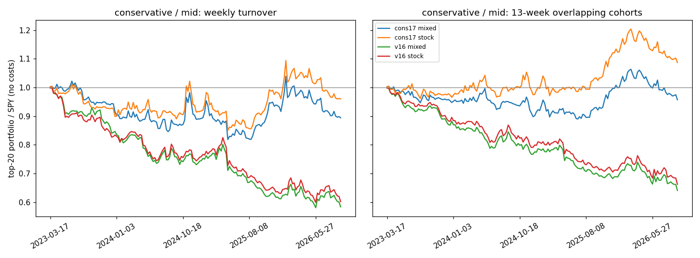

# 全市场选股 v1.7：候选开关的生产代码回放

v1.6 用生产代码回放历史，证明了只看股票名单和 tilt_b。v1.7 在同一套回放上测下一批候选：行业因子 G 的两种接法、保守档换口径、打分池去掉基金。候选、指标和取舍规则先写进了 [PREREGISTRATION.md](PREREGISTRATION.md)，本文件记录方法、运行方式和结果。

**结论**：v1.7 采纳两项，保守档换新口径（只看股票的前 20 名，每 63 天从跑输 SPY 2.9 个百分点变为跑赢 0.5 个百分点），打分池去掉基金（股票名单不变，算力减少约四成）。行业因子 G 的五种接法都让均衡、进取两档变差，没有采纳；D 家族 12 减 1 残差叠加在采纳方案上仍不通过。

## 与 v1.6 的差别

- **候选是生产代码里的开关，不是回放脚本里的公式**。`backend/app/services/eod_limited/options.py` 的 `ScoringOptions` 选行业模式和挂钩策略，`live_config.py` 的 `LiveConfig` 是生产的开关板（默认全部是 v1.6 行为），`market_registry.load_market_registry(extra_tilt_multipliers=...)` 承接倾斜，`universe.select_all_market_universe(fund_scope=...)` 承接基金范围。回放脚本 `scripts/replay.py` 只是按方案名打开这些开关。
- **默认关闭时与 v1.6 逐字节一致**：`tests/test_eod_v16_default_identity.py` 用 v1.6 代码（提交 3de252f9）生成的九组视图黄金样本守住默认路径；`tests/test_eod_v17_switches.py` 逐个开关验证行为；`tests/test_full_market_v17_replay.py` 验证回放机制（方案合成、输入共享、开关生效、评估表）。
- **行业分类数据**：`ticker_sic.json.gz`（2026-09-27 冻结）。生产上的取法在 `backend/app/services/eod_limited/industry.py` 的模块说明里：数据目录下一张持久化表（`industry-sic-v1.json.gz`），每次运行按预算补查目录里没见过的股票（Massive `/v3/reference/tickers/{ticker}` 的 `sic_code`），查不到不阻塞发布；`scripts/eod_industry_table.py import` 可以用冻结表做种子。选这条路而不是纯静态表或纯运行时查询的原因：静态表会随上市变化而过期；纯运行时查询第一次要查约 7,000 只，在客户端 4 路并发下约 10 分钟，超出任务的首轮时间预算。

## 回放方法

`scripts/replay.py` 对每个回放日 T：

1. 在当周点时目录上调用 `select_all_market_universe`；取 370 个交易日，`_session_manifest`、`_load_panel`、`prepare_limited_panel`。
2. 用冻结表按（代码, CIK）给当天面板里的股票贴 3 位和 4 位 SIC 分类（`SicTable.classify`）。
3. 把方案按输入集分组：基础输入（`v16`、`g3`、`g3x2`、`g4`、`cons17`、`d12m1`）、`full` 模式各粒度一份（`full3`、`full4`，`prepare_limited_panel(industry=...)` 后再 `precompute_all_horizon_inputs`）、基金范围一份（`nofund`）。每组各算一次预计算，组内共用；算完一组就释放，再算下一组。
4. 每个方案按自己的注册表（倾斜）和 `ScoringOptions` 调 `score_eod_session`，只打分该方案登记的档位；`_compact_variant`、`project_strength_payload`，再按 `/api/strength/scan` 的口径过滤排序。每行记下 3 位 SIC 的 `industry_id`，供「无分类比例」诊断使用。
5. 带 `residual` 的方案（`d12m1` 及其组合）用 506 日面板重算 D 家族残差再替换进输入，面板带不带行业跟随该方案的模式。

方案名可以用 `+` 合成（`g3+cons17`、`g3+cons17+d12m1`）：开关合并、档位取并集，同一开关被设两次会报错。第二阶段的组合就用这个写法，不新增代码。

`scripts/evaluate.py`、`scripts/paired.py` 与 v1.6 同口径，另加：基线名 `--baseline v16`；保守档候选与基线保守档比；预登记的稳健性配对（`g3`/`g4`、`full3`/`full4`）；无分类比例诊断；`nofund` 的逐日一致性检查（`identity.json`）；`--replay` 可以重复给出，把两台机器各跑一半日期的目录合并（共有的视图必须逐行一致，否则报错）。`scripts/compare_records.py` 逐行比对两次回放。

## 在 Colab 上运行

前提：G4 机器上已有 v1.6 阶段用的 `/content/data/replay.sqlite`、`/content/data/massive_directory_2026-09-27/` 和 venv；仓库切到 `claude/eod-v1.7` 分支的最新提交。另外把冻结的行业表放到 `/content/data/industry/ticker_sic.json.gz`（就是 scratchpad/industry/ 下那份，sha256 见同目录 manifest.json）。

下面 `$PY` 是 venv 的 python，`$S` 是 `research/option_pro_us_eod_v1/return_pack/full_market_v1_7/scripts`。

### 第 0 步：核对基线一致（两台机器都跑）

```
$PY $S/replay.py --db /content/data/replay.sqlite --directory /content/data/massive_directory_2026-09-27 \
  --industry-table /content/data/industry/ticker_sic.json.gz --out /content/replay/v17_verify \
  --dates 2023-05-30,2024-10-18,2026-05-27 --variants v16 --workers 3
$PY $S/compare_records.py --left /content/replay/verify_v16 --right /content/replay/v17_verify --map v15=v16
```

`/content/replay/verify_v16` 代表 v1.6 阶段用 v1.6 代码回放这三天的输出目录（当时的方案名是 `v15`，按实际路径替换）。必须打印 `views compared 27, identical 27`，退出码 0；否则停下来，把差异发回来。三天并行约 7 分钟。

### 第 1 步：第一阶段（两台机器各一半日期）

日期清单是 v1.6 第一阶段的 176 天（`stage1_run.json` 的 `dates`，把这个文件放到当前目录）。机器 A 跑偶数位、机器 B 跑奇数位，两边都带上第 0 步的三天，作为跨机器确定性检查：

```
# 机器 A
$PY $S/replay.py --db /content/data/replay.sqlite --directory /content/data/massive_directory_2026-09-27 \
  --industry-table /content/data/industry/ticker_sic.json.gz --out /content/replay/v17_stage1_a \
  --dates $(python3 -c "import json;d=json.load(open('stage1_run.json'))['dates'];print(','.join(sorted(set(d[0::2])|{'2023-05-30','2024-10-18','2026-05-27'})))") \
  --variants v16,g3,g3x2,g4,full3,full4,cons17,nofund --workers 40
# 机器 B：同上，d[1::2]，--out /content/replay/v17_stage1_b
```

每个回放日一个进程的预估（按 v1.6 日志的 330 到 510 秒预计算、每 6 组视图 105 到 160 秒打分推算）：
- 载入 20 秒；基础预计算 330 到 510 秒；`full3`、`full4` 各再一份（行业篮子只多约 5%）；`nofund` 一份，约一半大小；
- 打分：`v16` 9 组约 160 到 240 秒，`g3`、`g3x2`、`g4` 各约 110 到 160 秒，`full3`、`full4` 各 9 组约 160 到 240 秒，`cons17` 3 组约 60 秒，`nofund` 9 组约 160 到 240 秒；
- 合计约 40 到 55 分钟一天一核。每台 91 天、40 进程，约 2.5 轮，预计 1.7 到 2.3 小时。内存：每个进程同一时刻只持有一份预计算。

如果只有一台机器，把全部 176 天交给它，预计 3.5 到 4.5 小时；或者先去掉 `full4`，省约四分之一。

### 第 2 步：评估

```
$PY $S/evaluate.py --db /content/data/replay.sqlite --replay /content/replay/v17_stage1_a --replay /content/replay/v17_stage1_b --out results/stage1
$PY $S/paired.py   --db /content/data/replay.sqlite --replay /content/replay/v17_stage1_a --replay /content/replay/v17_stage1_b --out results/stage1
```

`evaluate.py` 合并两台机器的日期，三个重复日期上的 `v16` 视图必须一致，否则它会报错退出。产出 `metrics.csv`、`primary.csv`、`decision.json`（含 `pairs`）、`identity.json`、`label_status.json`；`paired.py` 产出 `paired.csv`。

### 第 3 步：第二阶段（按预登记决定配置后）

组合用 `+` 写，例如第一阶段 `g3` 和 `cons17` 通过：

```
$PY $S/replay.py ... --out /content/replay/v17_stage2 --variants v16,g3+cons17,g3+cons17+d12m1 --workers 40 \
  --start 2023-10-06 --end 2026-09-18 --every 5
```

`d12m1` 需要 506 日窗口，只能从 2023-10-06 起（148 天），与 v1.6 第二阶段相同；两个组合共用基础预计算，`d12m1` 那个每天多约 130 到 220 秒。评估时 `--dates-from 2023-10-06`，并把第一阶段目录一起传入，基线和单项候选就在同一批日期上可比。

## 结果

### 第一阶段

回放了 176 个信号日（2023-03-17 到 2026-09-14），8 个配置全部打分，覆盖闸门都通过；63 日标签完整的有 165 天。实际只用了一台 G4 机器，40 个进程跑全部 176 天，用时 3 小时 22 分。完整表格在 `results/stage1/`。

**基线一致**：
- 第 0 步的三天，27 组名单与 v1.6 验证输出逐行一致。
- 第一阶段的 `v16` 名单，与 v1.6 第一阶段的 tilt_b 名单（均衡、进取两档，176 天共 1,056 组）逐行一致。
- 与 v1.6 第二阶段 b 的基线（三档，148 天共 1,332 组）也逐行一致。

**主指标**：只看股票，前 20 名 63 日补位超额，三个周期视图的平均，单位是每个信号的百分点。

| 档位 | v16 | cons17 | g3 | g3x2 | g4 | full3 | full4 | nofund |
|---|---|---|---|---|---|---|---|---|
| 保守 | −2.90 | +0.54 | | | | −2.69 | −2.52 | −2.90 |
| 均衡 | +0.84 | | +0.65 | −0.09 | +0.68 | +0.94 | +0.95 | +0.84 |
| 进取 | +0.81 | | +0.33 | −0.36 | +0.38 | +0.54 | +0.50 | +0.81 |

**同一天配对的差值**：候选减 `v16`，63 日期限，t 值用 Newey-West 调整，滞后 11 阶。P1 到 2024 年底（91 天），P2 从 2025 年起（74 天）。

| 候选 | 档位 | 全部 | P1 | P2 |
|---|---|---|---|---|
| cons17 | 保守 | +3.44（t 4.0） | +3.04（t 3.1） | +3.92（t 2.8） |
| g3 | 均衡 | −0.19（t −0.5） | −0.66（t −2.1） | +0.39（t 0.6） |
| g3 | 进取 | −0.47（t −1.5） | −0.51（t −1.6） | −0.43（t −0.8） |
| g3x2 | 均衡 | −0.93（t −1.7） | −1.71（t −3.0） | +0.02（t 0.0） |
| g3x2 | 进取 | −1.17（t −2.3） | −1.36（t −2.5） | −0.94（t −1.1） |
| g4 | 均衡 | −0.17（t −0.4） | −0.82（t −3.0） | +0.64（t 1.0） |
| g4 | 进取 | −0.43（t −1.5） | −0.63（t −2.3） | −0.18（t −0.4） |
| full3 | 均衡 | +0.10（t 0.4） | −0.37（t −1.3） | +0.68（t 1.7） |
| full3 | 进取 | −0.26（t −0.9） | −0.46（t −1.5） | −0.03（t −0.1） |
| full4 | 均衡 | +0.11（t 0.3） | −0.60（t −2.4） | +0.98（t 1.8） |
| full4 | 进取 | −0.30（t −1.1） | −0.57（t −2.5） | +0.02（t 0.0） |
| full3 | 保守（被动变化） | +0.21（t 1.3） | +0.29（t 1.3） | +0.11（t 0.5） |
| full4 | 保守（被动变化） | +0.38（t 2.2） | +0.37（t 1.9） | +0.39（t 1.3） |
| nofund | 三档 | 每天都是 0 | | |

**保守档逐年**（只看股票，63 日补位超额；2026 年只有上半年的信号有完整标签）：

| 方案 | 2023 | 2024 | 2025 | 2026 |
|---|---|---|---|---|
| v16（v1.4 口径） | −3.36 | −2.15 | −2.04 | −5.52 |
| cons17 | +0.45 | +0.29 | +3.16 | −4.25 |

cons17 的其他指标：20 日补位超额 −0.01（v16 −1.20，配对差 +1.19，t 2.9）；名单长度中位数 15（v16 20）；相邻两期换掉 66% 的名单（v16 78%）。

**取舍**（按预登记规则和修订 1）：
- **cons17 采纳。** 规则 1、2、4、5 全部满足，同一天配对的 t 值 3.96，高于 2.0 的门槛。原来保守档每 63 天跑输 SPY 约 2.9 个百分点，换口径后跑赢约 0.5 个百分点。
- **G 的三种接法都不采纳。** g3、g4 在均衡、进取两档的 P1 都更差，主要输在 2024 年；G 倾斜加倍（g3x2）更差，剂量越大越差。加了 G 以后，前 20 名里没有 SIC 分类的股票从约 14% 降到 10%（g3）和 5%（g3x2），名单向有分类、所在行业正在走强的股票偏移，但这没有带来收益。
- **full3、full4 不采纳。** 两档的 P1 都更差；均衡档 P2 有改善（+0.68、+0.98），但不显著。它们让保守档被动变好了一点，这一条只是副作用的检查，不是采纳理由。
- **nofund 采纳。** 股票行与 `v16` 完全相同，所以股票名单的收益每天都一样，见修订 1。`identity.json` 是用改正后的比较重新生成的：九组视图、176 天全部一致；重跑时其余结果文件逐字节不变。它的好处在别处：打分池少了约 5,900 只基金，回放里每天的预计算从平均 461 秒降到 264 秒，打分从 128 秒降到 75 秒，各减少约四成；混排名单里基金只剩 12 只基准基金，首页读取的混排名单也因此接近股票名单（均衡档混排 63 日补位超额从 −0.57 变成 +0.80）。

### 回测数据与累计曲线

`results/stage1/backtest/` 下是 `v16` 和 `cons17` 的回测数据，由 v1.6 研究包的 `scripts/export_backtest.py` 生成，口径与 v1.6 相同（等权、空位补 SPY、不计成本、只算价格收益）：
- `top20_lists.csv`：每个信号日、每组视图的前 20 名；
- `daily_series.csv`：逐日的补位超额、命中率和名单长度；
- `equity_curves.csv`：「每周换仓」和「13 周重叠持有」两种组合相对 SPY 的累计值。



2026-09-14 各曲线的终点（中期视图，只看股票，组合除以 SPY）：

| 档位 | 方案 | 每周换仓 | 13 周重叠持有 |
|---|---|---|---|
| 保守 | cons17 | 0.96 | 1.09 |
| 保守 | v16（v1.4 口径） | 0.60 | 0.66 |
| 均衡 | v16（与 v1.6 相同） | 0.90 | 1.14 |
| 进取 | v16（与 v1.6 相同） | 0.89 | 1.14 |

保守档换口径后，持有约 3 个月的组合累计跑赢 SPY 约 9%，最高时约 20%，2026 年上半年回吐了一部分；原口径同期累计跑输约 34%。每周全部换仓时，所有名单仍然跑输 SPY，这一点和 v1.6 一样：刚上榜的强势股下一周常有短期回吐。

### 第二阶段

按修订 1，`S1` = `cons17+nofund`，`S2` = `S1` 再加 `d12m1`。回放 2023-10-06 到 2026-09-14 的 148 个信号日，其中 137 天有 63 日标签；一台 G4、40 个进程，75 分钟。完整表格在 `results/stage2/`。

交叉核对：
- `S1` 的股票行，与第一阶段的 `cons17`（保守档）和 `v16`（均衡、进取两档）在 148 天、1,332 组视图上逐行一致。去掉基金在保守档新口径下同样不改股票行。
- `S2` 的均衡、进取两档股票行，与 v1.6 第二阶段 b 用 v1.6 代码算出的 `d12m1` 名单，在 888 组视图上逐行一致。

同一天配对的差值（只看股票，63 日，对 `v16`）：

| 配置 | 档位 | 全部 | P1 | P2 |
|---|---|---|---|---|
| S1 | 保守 | +3.66（t 3.6） | +3.34（t 2.5） | +3.92（t 2.8） |
| S1 | 均衡、进取 | 0（与 `v16` 相同） | | |
| S2 | 保守 | +3.72（t 3.8） | +3.40（t 2.6） | +3.99（t 3.0） |
| S2 | 均衡 | +0.44（t 1.5） | +0.25（t 0.8） | +0.60（t 1.3） |
| S2 | 进取 | +0.18（t 1.1） | −0.07（t −0.3） | +0.39（t 1.9） |

**取舍**：
- **S1 采纳。** 保守档满足规则 1、2、4、5；均衡、进取两档与 `v16` 完全相同。
- **S2 不采纳。** 进取档 P1 比 `v16` 低，不满足规则 1。保守档比 S1 只多约 0.05 个百分点（两段中较小的提升），不到预登记要求的 0.2，不值得把行情缓存从 370 天加到 506 天。均衡档比 S1 多 0.25，但组合要三档一起判断。

所以 v1.7 上线 S1：保守档新口径，加上打分池去掉基金。

### 上线代码与评估方案一致

- 不带选项的打分函数，与 v1.6 代码生成的九组视图黄金样本逐项一致（`tests/test_eod_v16_default_identity.py`）。
- 回放脚本的 `live` 方案直接读生产开关板 `LIVE_CONFIG`。在 2023-05-30、2024-10-18、2026-05-27 三天：
  - 它与同一次回放里的 `cons17+nofund` 27 组名单逐行一致；
  - 它的股票行与第一阶段的 `cons17`（保守档）、`v16`（均衡、进取两档）27 组视图逐行一致；
  - 同一次回放里，v1.7 代码的 `v16` 与 v1.6 验证输出 27 组名单逐行一致。
